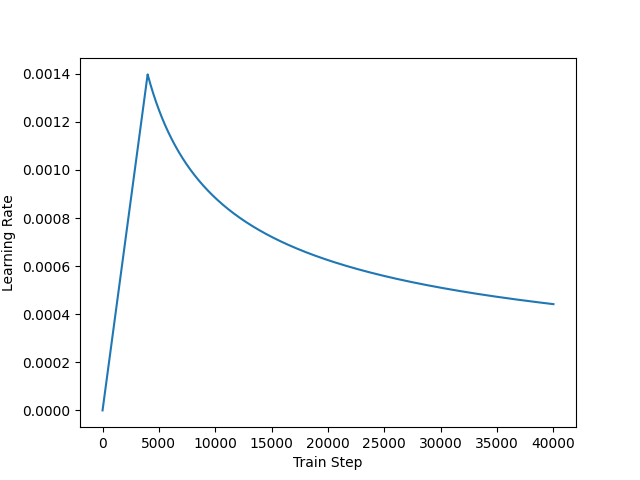

# Transformer——机器翻译（Spanish -> English）
## 一、tensorflow官方数据集——介绍  
```
tfds.core.DatasetInfo(
    name='ted_hrlr_translate',
    full_name='ted_hrlr_translate/pt_to_en/1.0.0',
    description="""
    Data sets derived from TED talk transcripts for comparing similar language pairs
    where one is high resource and the other is low resource.
    """,
    config_description="""
    Translation dataset from pt to en in plain text.
    """,
    homepage='https://github.com/neulab/word-embeddings-for-nmt',
    data_path='/root/tensorflow_datasets/ted_hrlr_translate/pt_to_en/1.0.0',
    file_format=tfrecord,
    download_size=124.94 MiB,
    dataset_size=10.89 MiB,
    features=Translation({
        'en': Text(shape=(), dtype=string),
        'pt': Text(shape=(), dtype=string),
    }),
    supervised_keys=('pt', 'en'),
    disable_shuffling=False,
    splits={
        'test': <SplitInfo num_examples=1803, num_shards=1>,
        'train': <SplitInfo num_examples=51785, num_shards=1>,
        'validation': <SplitInfo num_examples=1193, num_shards=1>,
    },
    citation="""@inproceedings{Ye2018WordEmbeddings,
      author  = {Ye, Qi and Devendra, Sachan and Matthieu, Felix and Sarguna, Padmanabhan and Graham, Neubig},
      title   = {When and Why are pre-trained word embeddings useful for Neural Machine Translation},
      booktitle = {HLT-NAACL},
      year    = {2018},
      }""",
)
```

## 二、快速开始

#### Requirements

- python==3.9
- tensorflow==2.10
- nltk==3.8.1
- tensorflow-datasets==4.9.2
- matplotlib==3.7.3
- protobuf==3.20.0

protobuf==3.20.0是为了调整tensorflow和tensorflow-datasets的版本兼容性。

#### main.py

注释掉代码中训练的函数，运行main.py就可以快速启动体验了，权重在checkpoints文件夹中。

* you can also use .ipynb to start quickly.

**warning**: .ipynb训练的权重与.py训练的权重不可以共用，如有需求需要分别训练。
## 三、超参数调整

#### settings.py

```python
BUFFER_SIZE = 20000 		# 缓冲池大小，数据集打乱随机取样填充，一般设置为大于等于数据集的大小
BATCH_SIZE = 64 				# 批处理大小
MAX_LENGTH = 40 				# 最大长度，限制句子长度，这里调整的是tokens的最大值
NUM_LAYERS = 4					# encoder和decoder的数量
D_MODEL = 128						# 注意力层神经元数
DFF = 512								# 前馈前馈网络的神经元数
NUM_HEADS = 8						# 注意力头数
DROPOUT_RATE = 0.1			# dropout的概率
EPOCHS = 10							# 训练轮数
```

## 四、位置编码、学习率与评价指标

#### position embedding


#### warm-up



#### 机器翻译评价指标-BLEU

> 一下代码能够帮你快速理解bleu的工作原理，更详细的原理请参考文献。

公式如下：  
$$  
bleu = exp^{∑ weight∗logP}∗惩罚系数  
$$


```python
from nltk.translate.bleu.score import sentence_bleu
reference = [['the','quick','brown','fox','jumped','over','the','lazy','dog']]
candidate = ['the','quick','brown','fox','jumped','over','the','lazy','dog']
score = sentence.bleu(reference, candidate)
print(score)
# out: 1.0

# 4-gram cumulative BLEU
candidate = ['the','fast','brown','fox','jumped','over','the','lazy','dog']
score = sentence_bleu(reference, candidate, weights=(0.25, 0.25, 0.25, 0.25))
print(score)
# out:0.75

# 手动计算
import numpy as np
score = np.exp(0.25 * (np.log(8/9) + np.log(6/8) + np.log(5/7) + np.log(4/6)))
print(score)
# out:0.75
```
[知乎文章]([https://www.zhihu.com/question/473208103/answer/3331617029](https://zhuanlan.zhihu.com/p/673135990)https://zhuanlan.zhihu.com/p/673135990)
